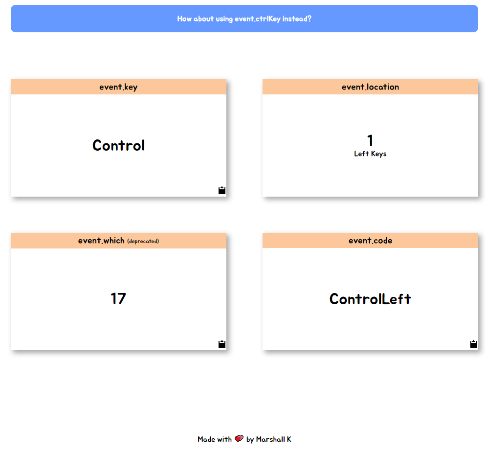

# Javascript Keycode

Usage : https://marshall-ku.github.io/Javascript-Keycode/

***

Press any button to see event.key, event.location, event.which, event.code.

If you click clipboard icon, the content of it will be copied to your clipboard.